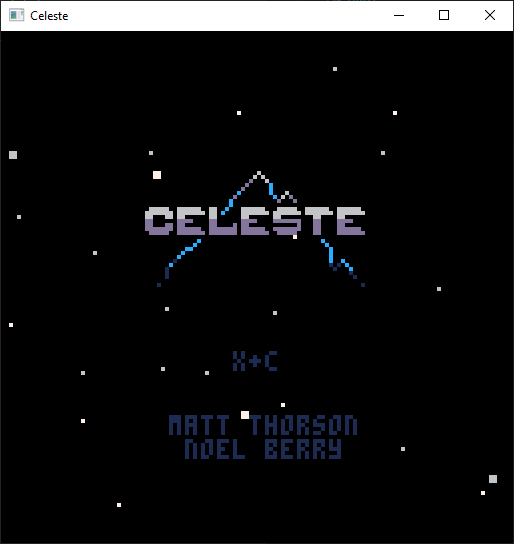

# risc86

Emulate (& soon transpile) RISCV code into executable x86 code.

## Overview
- rvm32i: all instructions (excluding ebreak) emulated 
- rvm32f: all floating point instructions emulated 
- rvm32m: all multiplication instructions emulated 
- rvm32d: all double precision instructions emulated 
- important syscalls emulated (added as samples increase)
- emulating sdl possible via custom syscall wrapper 
- parse file directly into emulator 
- bp system added to debug any issues

## Plans 
- code gen 
- rewrite emulator to use jit
- implement LRU + block jitting for performance
- rewrite the god forsaken R instruction class

## Project Structure

Currently, the project is split up like this:

1. **breakpoint** (`src/breakpoint`): this folder holds the breakpoint system that the emulator uses whenever you want to debug a program.
2. **decoder** (`src/decoder`): this folder holds the decoder class which is essentially what the handler will call to decode each instruction before emulating.
3. **external** (`src/external`): this folder holds any external libraries we might use. 
4. **handler** (`src/handler`): this folder holds the main control of the emulator, it will get everything set up to emulate. 
5. **instruction** (`src/instruction`): this folder holds all the information regarding all the types of instructions, here is where they're individualised and emulated. 
6. **sdl** (`src/sdl`): this folder holds a helper structure for anything sdl related 
7. **syscalls** (`src/syscalls`): this folder holds anything syscall related 

